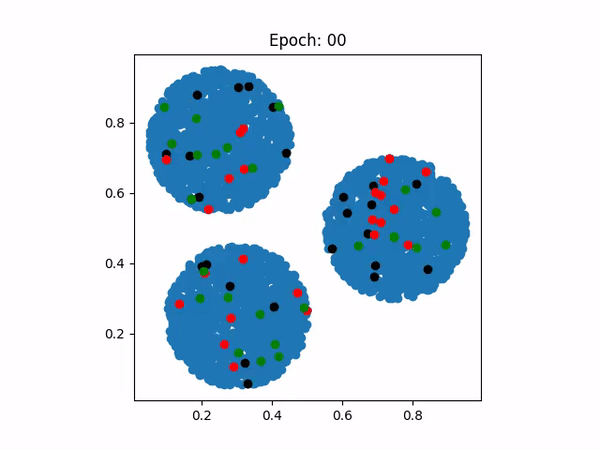
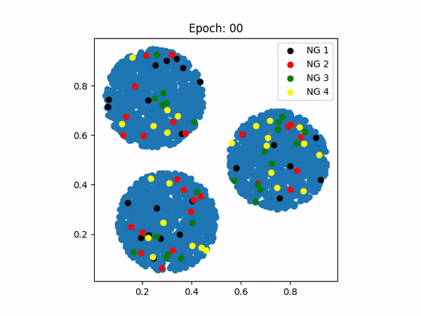

# Multi Neural Gas
This repository contains our teamwork ([Ilaha Manafova](http://github.com/IlahaM) & I) projects in the context of "Technical Neural Networks (TNN)" course taught by Prof. Goerke at the University of Bonn.

## What is Neural Gas?
According to Wikipedia:

> Neural Gas (NG) is an artificial neural network, inspired by the self-organizing map (SOM) introduced in 1991. The NG is a simple algorithm for finding optimal data representations based on feature vectors. 

Additionally, it is named  "Neural Gas" because of the similarity between the movement of the neurons during the adaptation process and the movement of gas particles. NG can be applied for data compression or vector quantization tasks.

## What is Multi Neural Gas?
Multi Neural Gas (MNG) is an extension of the original Neural Gas (NG) algorithm. The MNG is a generalization of the NG algorithm. 

MNG consists of a group of partner NG networks. Each of the partners is treated as an NG of its own separately. The partner Neural-Gas can be completely different in size. Additionally, the learning applies to only those neurons that belong to the NG where the winner neuron belongs (winner Gas).

## What does this repository contain?
This repository contains the implementation of the MNG algorithm in Python from scratch. In this project, the MNG deals with the problem of representing the N-dimensional space which is divided into several non-overlapping circular regions distributed through the unit cube. 

The MNG is trained to represent the input space with M NGs and each containing K neurons. The MNG is trained by the following steps:

1. The input vector (also called stimulus) is presented to the MNG.
2. The winner neuron is found in each of the NGs.
3. The winner network is found by finding the NG to which the winner neuron belongs.
4. The winner neuron and its neighbors are updated in the winner network.

### Problem setup and parameters
The input space is divided into 3 circular 2-dimensional (N=2) regions (the user can later play with the number of regions, their size, and their distribution). We used M=4 NGs and K=25 neurons in each NG. The input vectors are presented to the MNG in random order and the MNG is trained for 40 epochs. You can also find the found centers of the NGs in the `centers.txt` file.

We used the Gaussian function as the neighborhood function with adjustable parameter $\sigma$ as follows:

$$neighborhood(distance, \sigma) = e^{-\frac{distance^2}{2\cdot\sigma^2}}$$

Besides, we used an exponentially decaying learning rate decaying from $\eta_0$ to $\eta_{final}$ as follows:

$$\eta(t) = \eta_0 \cdot (\frac{\eta_{final}}{\eta_0})^{\frac{t}{T_{max}}}$$

where $T_{max}$ is the total number of epochs.

### Results
In our experiments, the MNG was able to capture the structure and distribution of the input space. The following videos show the evolution of the centers of the 3 and 4 NGs during the training process trained for 50 and 40 epochs, respectively.

M=3 NGs, K=25| M=4 NGs, K=25
:----:|:----:
</img>| </img>

